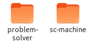
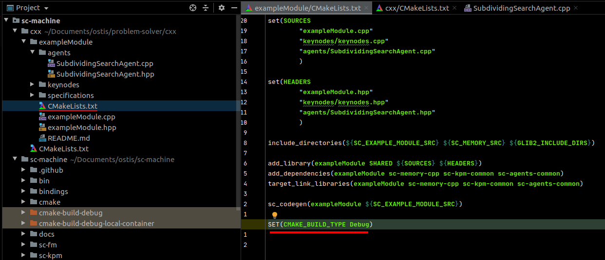
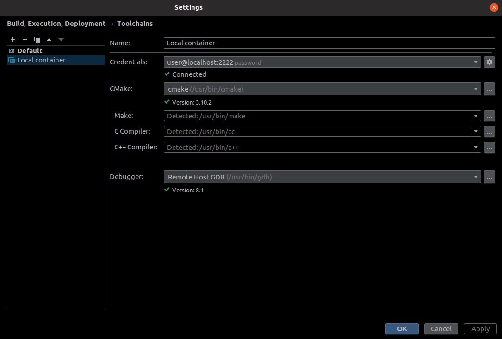
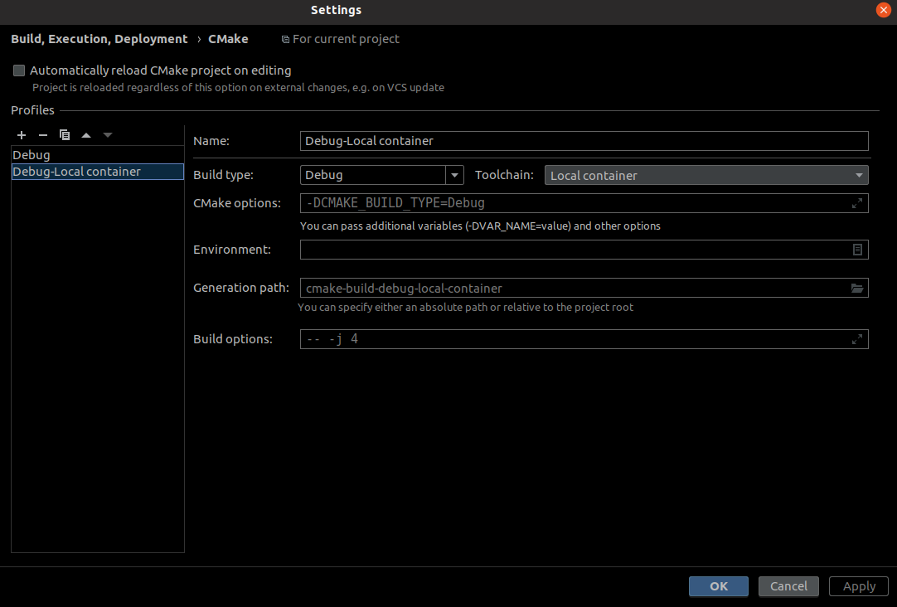
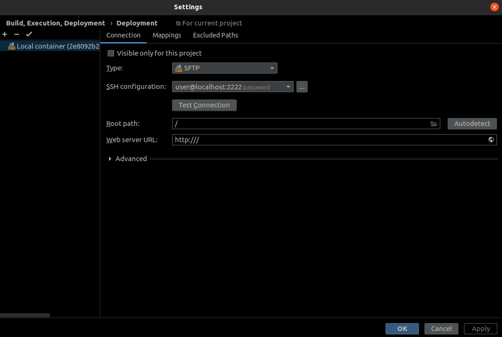
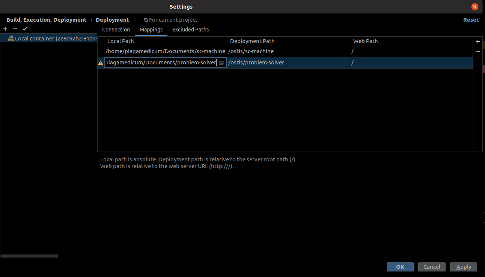
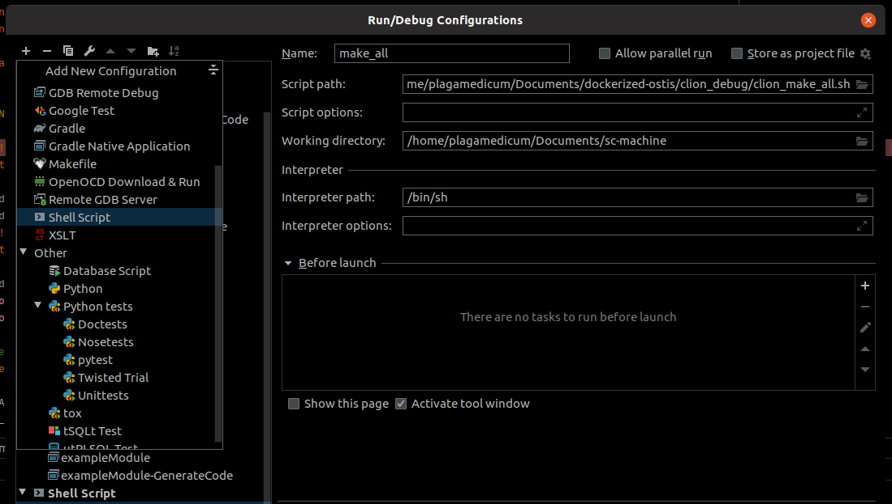

# Dockerized OSTIS

This is the official repository of the [Docker image](https://hub.docker.com/r/ostis/ostis) for [OSTIS](http://ims.ostis.net).

OSTIS (*Open Semantic Technology for Intelligent Systems*) is an open-source integrated mass technology for component-based intelligent systems design.

For application examples, visit the [OSTIS Applications](https://github.com/ostis-apps/) page.

## Docker Installation

Please find installation instructions for your operating system [here](https://docs.docker.com/install).

## Available image tags (versions)

To find an actual versions released as Docker images please see the [list of Docker hub tags](https://hub.docker.com/r/ostis/ostis/tags/).

Current versions:
* [`scp_stable`](https://github.com/ostis-apps/ostis-example-app/tree/scp_stable) - allows usage of agents on SCP.
* [`0.5.0`](https://github.com/ostis-apps/ostis-example-app/tree/0.5.0) - allows usage of agents on C++.
* [`0.6.0`](https://github.com/ostis-apps/ostis-example-app/tree/0.6.0) -  allows usage of [JSON-based Websocket protocol](http://ostis-dev.github.io/sc-machine/http/websocket/) to communicate with knowledge base, and new interface version.

## Quickstart
You can run the OSTIS container like so:
* for `scp_stable` version:
  ```bash
  docker run -it -p 8000:8000 ostis/ostis:scp_stable
  ```
* for `0.5.0` version:
  ```bash
  docker run -it -p 8000:8000 ostis/ostis:0.5.0
  ```
* for `0.6.0` version:
  ```bash
  docker run -it -p 8000:8000 -p 8090:8090 ostis/ostis:0.6.0
  ```
Open `localhost:8000` in your browser to see web interface. For `0.6.0` version new interface version will be available on `localhost:8090`.

**Note**: you can specify custom port like so using `-p 8080:8000` as an example to run on `localhost:8080`.

## How to customize image

Custom knowledge base source folder and agents source folder can be set up using Docker volumes.

Add ``` -v full_path_to_kb_folder:/ostis/kb``` to specify your local folder with kb sources. 

Note that if you're using custom kb then kb folder should contain *ui_main_menu* and *ui_start_sc_element* like [here](https://github.com/ostis-apps/dockerized-ostis/tree/v0.5.0/kb). 
Be aware that by using custom kb you will not override existing ims.ostis.kb but add additional knowledge base sources.

Add ``` -v full_path_to_problem_solver_folder:/ostis/problem-solver``` to specify your local folder with problem-solver sources. 

Note that C++ agents should be inside **problem-solver/cxx** folder, SCP agents should be inside **problem-solver/scp** folder.

Example of the image usage:
```bash
docker run -it -v /home/user/test/kb:/ostis/kb -v /home/user/test/problem-solver:/ostis/problem-solver -p 8000:8000 -p 8090:8090 ostis/ostis:0.5.0 sh ostis [OSTIS FLAGS]
```
OSTIS FLAGS:
  * `--help -h` - Print help message
  * `--all -a` - Run all services
  * `--sc-mashine --scm` - Rebuild sc-machine
  * `--build_kb --kb` - Rebuild kb
  * `--sc-web --web` - Run sc-web only
  * `--sctp` - Run sctp only

## Run image locally using script

Run script has additional useful options comparing to Quickstart section. To run:
1. Clone [the repo](https://github.com/ostis-apps/dockerized-ostis):
  ```bash
  git clone https://github.com/ostis-apps/dockerized-ostis
  ```
2. Checkout to branch according to version you need
3. Run the script with needed options:
  ```bash
  ./run.sh [OPTIONS]
  ```
  See flags with
  ```bash
  run.sh --help
  ```
  OPTIONS:  
  * `--help -h` - Print help message
  * `--port -p` - Set a custom port
  * `--app` - Set a custom path to the app directory(By default, it is expected, that inside the app you have all default directories for kb, problem-solver etc)
  * `--kb` - Set a custom path to kb directory
  * `--solver` - Set a custom path to problem-solvers deirectory
  * `--startflags --sf` - To set container startup flags(using `--all` by default). Usage: `--startflags "[OSTIS FLAGS]"` (quotes are necessary for multiple flags!)
    Example of usage:
  ```bash
  ./run.sh --app ~/ostis-example-app
  ```

## Building image locally

To build image locally you will need:
1. Clone [the repo](https://github.com/ostis-apps/dockerized-ostis):
  ```bash
  git clone https://github.com/ostis-apps/dockerized-ostis
  ```
1. Checkout to branch according to version you need
1. Run build image script:
  ```bash
  ./build_image.sh
  ```

## CLion Integration

**Please, read following at [the page of our github repository](https://github.com/ostis-apps/dockerized-ostis).**

### Environment

1. Clone sc-machine [repo](https://github.com/ShunkevichDV/sc-machine).
  ```bash
  git clone --single-branch --branch 0.5.0 https://github.com/ShunkevichDV/sc-machine.git
  ```
2. Add problem-solver folder with your agents beside the sc-machine's folder.  
    
3. Add `SET(CMAKE_BUILD_TYPE Debug)` at the end of `CMakeLists.txt` of your module.  
     

### Workflow with configured CLion

1. Build clion debug image(Don't forget to do this every time you update the repository):
  ```bash
  ./clion_debug/build_image.sh
  ```
2. Run clion debug container with needed options:
  ```bash
  ./clion_debug/run_container.sh [OPTIONS]
  ```
  See flags with
  ```bash
  ./clion_debug/run_container.sh --help
  ```
  OPTIONS:
  * `--help -h` - Print help message
  * `--port -p` - Set a custom port
  * `--app` - Set a custom path to the app directory(By default, it is expected, that inside the app you have all default directories for kb, problem-solver etc)
  * `--kb` - Set a custom path to kb directory
  * `--solver` - Set a custom path to problem-solvers deirectory
  * `--startflags --sf` - To set container startup flags(using `--build_kb --sc-web` by default). Usage: `--startflags "[OSTIS FLAGS]"` (quotes are necessary for multiple flags!)  
    Example of usage:
  ```bash
  ./clion_debug/run_container.sh --app ~/ostis-example-app
  ```
3. Debug your code! (See project configuration below)
4. After finishing your work stop and remove debug container:
  ```bash
  ./clion_debug/stop_container.sh
  ```

### Configuring CLion

1. Add toolchain in __Settings/Preferences | Build, Execution, Deployment | Toolchains__ adding new ssh connection. Default user is `user` and password is `password`.  
     
    
1. Add new CMake profile for container in __Settings/Preferences | Build, Execution, Deployment | CMake__.  
    
1. Configure container's deployment connection and folders mapping in __Settings/Preferences | Build, Execution, Deployment | Deployment__.  
    
    
1. Update CMake project.  
    
1. After successfully updating your CMake project you'll see sc-machine running configurations and problem-solver folder module.
1. Add make_all configuration for rebuilding sc-machine inside the container and update local dependencies.  
    
1. Update sctp-server debug configuration with dependencies and make_all script.  
    
1. Be sure that you choose "Debug-Local container" option in configurations.
    
1. Add breakpoints and start working!

## Contribute

Pull requests are very welcome!

It would be great to hear your feedback and suggestions in the [issue tracker](https://github.com/ostis-apps/dockerized-ostis/issues)!
